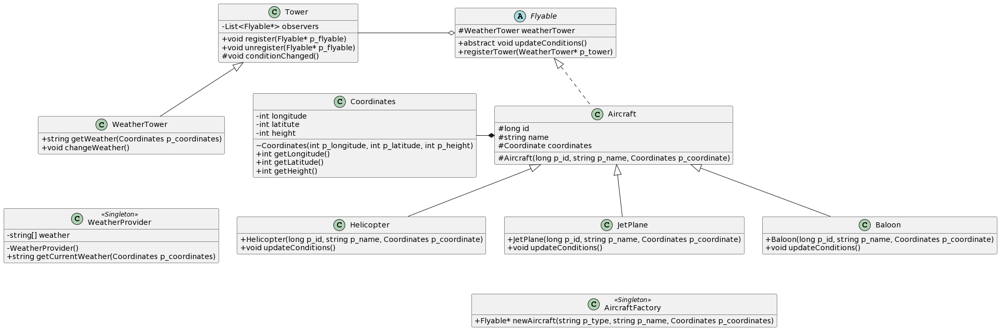

# avaj_launcher


Build project using: 

```
    find * -name "*.java" > sources.txt
    javac @sources.txt
```


Run using:
```
    java -cp src Simulator <file>
```


## Subject

You need to implement an aircraft simulation program based on the class diagram pro-
vided to you. All classes are required to be implemented respecting every detail provided
in the diagram. Feel free to add more classes or include additional attributes if you think
it is necessary, but do not change access modifiers or the class hierarchy for the classes
provided in the diagram

